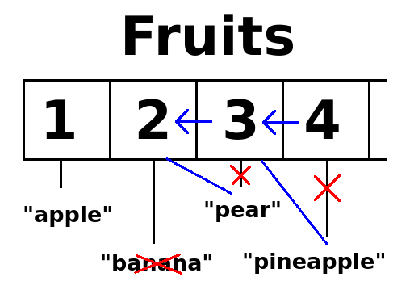

+++
title = 'lua'
date = 2024-03-09T13:56:00+07:00
tags = ['lua', 'programming']
draft = true
+++

## for loop

```
for i=1, 5 do

    print(i)

end

```

custom increment with

```
for i=1,5,2 do

    print(i)

end

```

### ipairs

ipairs is for loop alternative

```
for i,v in ipairs(fruits) do

    print(i, v)

end
```

It's basically a shorthand for `fruits[i]`

## list

list is called table.

can be initialized with 

```
fruits = {"apple", "banana"}
```

access first value start from 1, not zero

```
fruits[1]
```

### insert / remove

```
table.insert(fruits, "pear")

table.remove(fruits, 2)

```



When you remove a value from a table with `table.remove`, all
 the following items in the table will move up. So what was on position 3
 is now on position 2 in the table. And what was on position 4 is now on
 position 3.

### loop

use # to get length of a ~~table

```
for i=1,#fruits do

    print(fruits[i])

end

```


